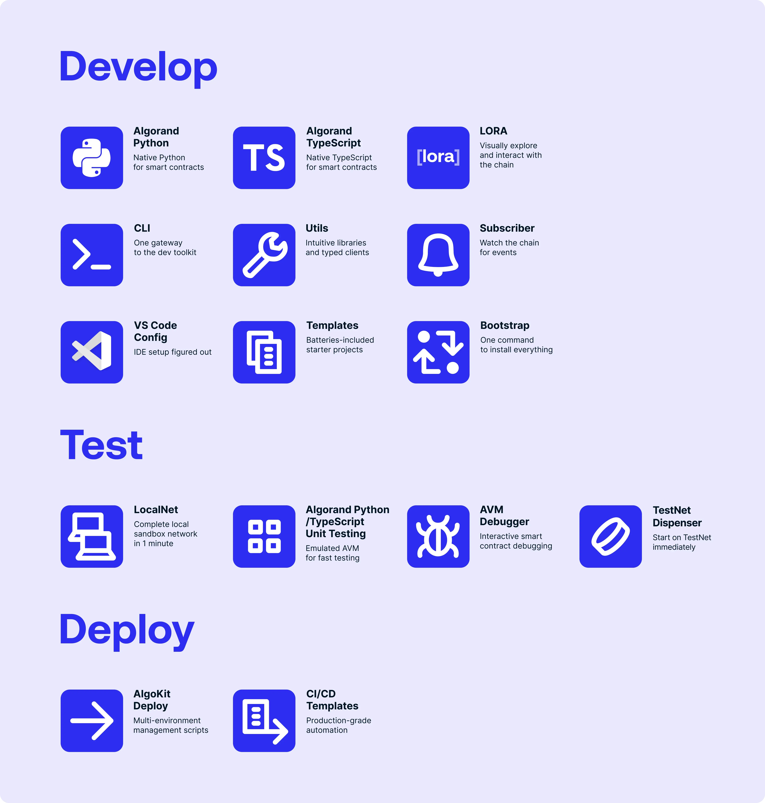

<div align="center">
<a href="https://github.com/algorandfoundation/algokit"></a>
</div>

<br/>

<p align="center">
    <a target="_blank" href="https://github.com/algorandfoundation/algokit-cli"></a>
    <a target="_blank" href="https://github.com/algorandfoundation/algokit-utils-py#readme"></a>
    <a target="_blank" href="https://github.com/algorandfoundation/algokit-utils-ts#algokit-typescript-utilities"></a>
    <a target="_blank" href="https://github.com/algorandfoundation/algokit-client-generator-py"></a>
    <a target="_blank" href="https://github.com/algorandfoundation/algokit-client-generator-ts"></a>
</p>

# AlgoKit: Complete Development Platform for Algorand

## What is AlgoKit?

AlgoKit is a comprehensive development platform for building applications on the Algorand blockchain. Think of it as your complete toolkit that takes you from initial development all the way through to production deployment.

AlgoKit eliminates the usual headaches of blockchain development by providing a streamlined, integrated experience from your first line of code to your application running in production.

## Key Features



### 🚀 Development

AlgoKit provides everything you need to start building on Algorand:

- **Multi-Language Support**: Write smart contracts in either Python or TypeScript - whichever you're more comfortable with
- **LORA**: Visually explore and interact with the blockchain, making it easier to understand what's happening
- **Unified CLI**: Your central command center, giving you access to all development tools from one place
- **Utility Libraries**: Pre-built components and helpers to accelerate your development
- **Event Monitoring**: Built-in capabilities to track and respond to blockchain events
- **VS Code Integration**: Seamless coding experience with syntax highlighting, debugging, and more
- **Project Templates**: Get started quickly with pre-configured project structures
- **Bootstrap Command**: Set up everything with a single installation command

### 🧪 Testing

Ensure your applications work correctly before going live:

- **Local Network**: Spin up a complete local Algorand network in just one minute for testing
- **Comprehensive Unit Testing**: Run thorough tests for your smart contracts
- **Interactive Debugging**: Debug your code interactively to find and fix issues quickly
- **TestNet Integration**: Easily obtain TestNet tokens when you're ready to test on the actual test network

### 🌐 Deployment

Handle the complexity of getting your application live with ease:

- **Smart Deployment Scripts**: Manage multiple environments (development, staging, and production) seamlessly
- **CI/CD Templates**: Automate your entire deployment pipeline with production-grade practices
- **Environment Management**: Configure and deploy to different networks with confidence

## Core Components

### 🎯 AlgoKit CLI
**Your Command Center for Algorand Development**

 

The AlgoKit CLI is the main entry point that brings all tools together under one unified interface. It handles project creation, local development environments, contract deployment, and code generation - eliminating the need to juggle multiple tools.

Key capabilities include:
- Initialize new projects from official templates (React, Python, TypeScript)
- Manage local Algorand sandbox environments
- Compile and deploy smart contracts to any network
- Generate type-safe clients from your contracts
- Access integrated debugging and blockchain exploration tools

[Repo](https://github.com/algorandfoundation/algokit-cli) | [Quick Start Tutorial](https://github.com/algorandfoundation/algokit-cli/blob/main/docs/tutorials/intro.md) | [Documentation](https://github.com/algorandfoundation/algokit-cli/blob/main/docs/algokit.md)

>[!NOTE] 
> By using the AlgoKit cli you will use all the below listed packages, no need to install them separately

### 🐍 Algorand Python (Puya)
**Write Smart Contracts in Native Python**

Algorand Python is a semantically and syntactically compatible, typed Python language that works with standard Python tooling and allows you to express smart contracts (apps) and smart signatures (logic signatures) for deployment on the Algorand Virtual Machine (AVM).

Algorand Python revolutionizes smart contract development by letting you write in familiar Python syntax that compiles to optimized TEAL. No more learning low-level assembly - just write Python with type hints and let the compiler handle the complexity.

What makes it special:
- Use Python 3.12+ syntax with full type checking
- Automatic optimization to efficient TEAL bytecode
- Source-level debugging with mapping back to your Python code
- Built-in support for Algorand standards (ARC4)
- Seamless integration with Python testing frameworks

[See how to get started](https://github.com/algorandfoundation/puya)

### 📚 AlgoKit Utils (Python & TypeScript)
**High-Level Libraries for Rapid Development**

AlgoKit Utils provides intuitive wrapper functions around the Algorand SDKs, turning complex blockchain operations into simple function calls. Available in both Python and TypeScript, these libraries handle the boilerplate so you can focus on your application logic.

The goal of this library is to provide intuitive, productive utility functions that make it easier, quicker and safer to build applications on Algorand. Largely these functions wrap the underlying Algorand SDK, but provide a higher level interface with sensible defaults and capabilities for common tasks.

Core functionality:
- Simplified smart contract deployment and method calls
- Transaction composition with automatic fee handling
- Account creation and management utilities
- Testing helpers and fixtures for unit tests
- Debugging tools with transaction simulation
- Easy integration with Algorand indexer

#### Python 


[Repo](https://github.com/algorandfoundation/algokit-utils-py#readme) | [Documentation](https://algorandfoundation.github.io/algokit-utils-py/) 

#### TypeScript 


[Repo](https://github.com/algorandfoundation/algokit-utils-ts#algokit-typescript-utilities) | [Documentation](https://github.com/algorandfoundation/algokit-utils-ts/tree/main/docs)

### 🔧 Client Generators (Python & TypeScript)
**Automatic Type-Safe Contract Interfaces**

This project generates a type-safe smart contract client in both Python and TypeScript for the Algorand Blockchain that wraps the [application client](https://github.com/algorandfoundation/algokit-utils-ts/blob/main/docs/capabilities/app-client.md) in AlgoKit Utils. It does this by reading an [ARC-0032](https://github.com/algorandfoundation/ARCs/blob/main/ARCs/arc-0032.md) or [ARC-0056](https://github.com/algorandfoundation/ARCs/blob/main/ARCs/arc-0056.md) application spec file.

Client generators read your smart contract specifications and automatically create typed client code. This ensures your application code stays perfectly synchronized with your contracts, catching errors at compile time instead of runtime.

Benefits include:
- Full IntelliSense and auto-completion in your IDE
- Type-safe method calls with proper parameter validation
- Automatic updates when contracts change
- Generated documentation from contract metadata
- Support for both Python and TypeScript/React applications

#### Python 


[Repo](https://github.com/algorandfoundation/algokit-client-generator-py) | [Examples](https://github.com/algorandfoundation/algokit-client-generator-py/tree/main/examples) 

#### TypeScript 


[Repo](https://github.com/algorandfoundation/algokit-client-generator-ts) | [Examples](https://github.com/algorandfoundation/algokit-client-generator-ts/tree/main/examples)

### 🐛 AVM Debugger
**Professional Debugging for Smart Contracts**

The AVM Debugger VS Code extension brings modern debugging capabilities to Algorand development. Set breakpoints, step through execution, and inspect state changes - just like debugging any other application.

The AlgoKit AVM VS Code debugger extension provides a convenient way to debug any Algorand Smart Contracts written in TEAL.

Debugging features:
- Visual breakpoints in TEAL or source code
- Step-by-step execution control
- Real-time stack and state inspection
- Source mapping for high-level languages
- Transaction simulation before deployment

[More info](https://marketplace.visualstudio.com/items?itemName=AlgorandFoundation.algokit-avm-vscode-debugger)

### 💰 TestNet Dispenser
**Instant Test Tokens for Development**

The TestNet Dispenser removes friction from testing by providing programmatic access to test Algos. No more manual faucet visits or waiting - get tokens instantly through the API or CLI.

The AlgoKit TestNet Dispenser API provides functionalities to interact with the Dispenser service. This service enables users to fund and refund assets, testnet Algos only for now.

How it helps:
- RESTful API for automated testing workflows
- CLI commands for quick manual testing
- Bulk funding for multiple test accounts
- Refund unused tokens to be a good citizen
- Fair usage policies to ensure availability

[Documentation](./docs/testnet_api.md)

## Getting Started

### Quick Install (Recommended)
```bash
# Install AlgoKit
pipx install algokit

# Create a new project
algokit init

# Start building!
```

### Developer Setup - Clone All Repositories

If you're contributing to AlgoKit or want to work with the full source code locally, you can clone all AlgoKit repositories at once:

```bash
# One-liner: Download and run the installation script
curl -sSL https://raw.githubusercontent.com/algorandfoundation/algokit/main/scripts/install_all_repos.sh | bash
```

Or download first to inspect:
```bash
# Download the script
curl -sSL https://raw.githubusercontent.com/algorandfoundation/algokit/main/scripts/install_all_repos.sh -o install_algokit.sh

# Make it executable and run
chmod +x install_algokit.sh
./install_algokit.sh
```

This script will:
- Clone all AlgoKit repositories into an organized directory structure
- Give you the choice between HTTPS or SSH URLs
- Skip repositories that already exist locally

## Next Steps

- Explore the [AlgoKit CLI documentation](https://github.com/algorandfoundation/algokit-cli/blob/main/docs/algokit.md)
- Try the [Quick Start Tutorial](https://github.com/algorandfoundation/algokit-cli/blob/main/docs/tutorials/intro.md)
- Check out example projects
- Join the Algorand Developer community

---

*AlgoKit - Making Algorand development accessible, efficient, and enjoyable.*